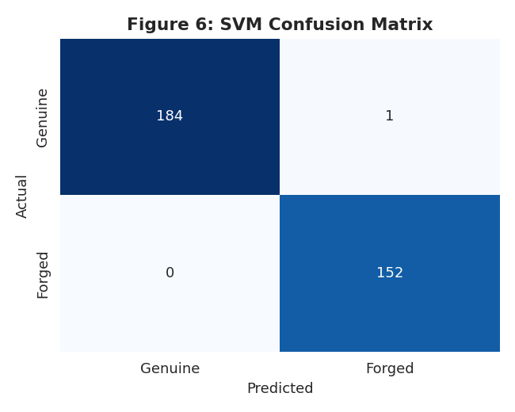
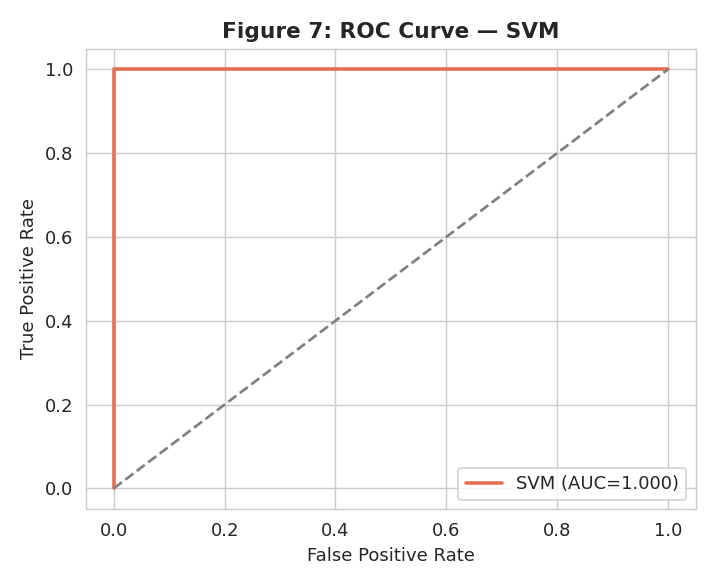
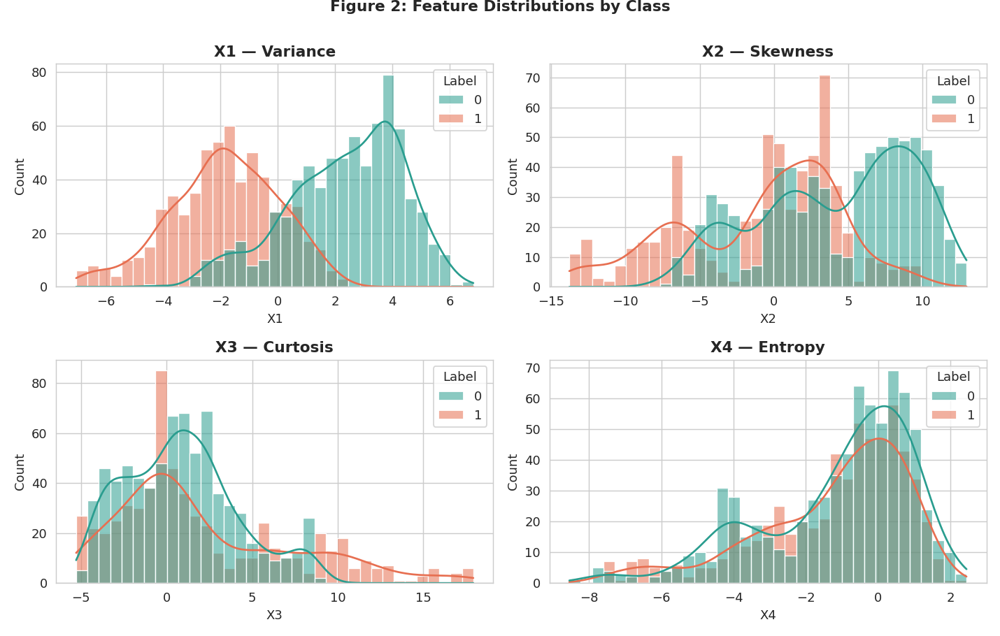

# Banknote Authentication using Machine Learning

A complete, end-to-end machine learning project that detects counterfeit banknotes from features extracted via the wavelet transform of note images. The pipeline covers data cleaning, exploratory data analysis, a classification model (SVM) and a regression model, with full evaluation and visualisations.


---

## Overview

Currency counterfeiting causes real economic harm, and manual inspection is slow and subjective. This project trains a model to authenticate banknotes automatically using four numerical features derived from the wavelet transform of each note's image. It demonstrates the standard data-science life cycle: **preprocess → explore → model → evaluate → visualise**.

## Dataset

The dataset (`data/Data_Feb_2026.csv`) contains **1,375 records** with four predictors and a binary target:

| Feature | Meaning |
|---------|---------|
| `X1` | Variance of the wavelet-transformed image |
| `X2` | Skewness of the wavelet-transformed image |
| `X3` | Curtosis of the wavelet-transformed image |
| `X4` | Entropy of the image |
| `Label` | `0` = genuine, `1` = forged |

It is based on the UCI Banknote Authentication dataset (Lohweg, 2013).

## Project Structure

```
banknote-authentication-ml/
├── data/
│   └── Data_Feb_2026.csv        # raw dataset (uncleaned)
├── src/
│   └── banknote_pipeline.py     # full pipeline: clean → EDA → models → plots
├── figures/                     # all generated visualisations
│   ├── fig1_class_dist.png
│   ├── fig2_distributions.png
│   ├── ...
│   └── fig10_reg_compare.png
├── requirements.txt
├── .gitignore
└── README.md
```

## Installation & Usage

```bash
# 1. clone the repo
git clone https://github.com/<your-username>/banknote-authentication-ml.git
cd banknote-authentication-ml

# 2. (optional) create a virtual environment
python -m venv venv
source venv/bin/activate      # Windows: venv\Scripts\activate

# 3. install dependencies
pip install -r requirements.txt

# 4. run the pipeline
python src/banknote_pipeline.py
```

The script prints the cleaning summary and all evaluation metrics to the terminal, and displays the ten figures one by one.

## Methodology

**1. Data cleaning.** Removed 25 duplicate rows, 1 record with a missing label, and 1 corrupted row containing impossible sensor values (e.g. `X1 = -70`). Result: **1,348 clean records**.

**2. Exploratory data analysis.** Examined class balance (54.7% genuine / 45.3% forged), feature distributions by class, and correlations. Variance (`X1`) is the strongest predictor of authenticity (correlation **−0.74**); skewness and curtosis are themselves strongly correlated (**−0.79**).

**3. Classification — Support Vector Machine.** Features standardised, 75/25 stratified split, RBF-kernel SVM.

**4. Regression — predicting skewness.** Used the strong inter-feature correlation to predict `X2` from the other three features — a practical mechanism for reconstructing a corrupted reading like the one found in cleaning. Linear Regression is compared against a Random Forest.

## Results

### Classification (SVM)

| Metric | Score |
|--------|-------|
| Accuracy | **0.997** |
| Precision | 0.994 |
| Recall | **1.000** |
| F1-score | 0.997 |
| ROC-AUC | **1.000** |

Only one misclassification across 337 test notes, with **perfect recall** — no forgery was missed, which is the critical requirement in a security setting.

<p align="center">
  
  
</p>

### Regression (target: skewness `X2`)

| Model | R² | RMSE | MAE |
|-------|-----|------|-----|
| Linear Regression | 0.737 | 3.034 | 2.522 |
| Random Forest | **0.936** | **1.501** | **0.885** |

The large jump from linear to Random Forest shows the relationship between features is partly **non-linear**, which the ensemble captures.

<p align="center">
  
</p>

## Key Findings

- The four wavelet features separate genuine and forged notes almost perfectly — SVM reaches 99.7% accuracy with perfect recall.
- Variance is by far the most discriminative feature.
- Image features are interdependent, so a missing/corrupted feature can be reconstructed by regression (R² up to 0.94), adding robustness to the scanning pipeline.

## Tech Stack

`Python` · `pandas` · `NumPy` · `scikit-learn` · `Matplotlib` · `seaborn`

## References

- Cortes, C. and Vapnik, V. (1995) 'Support-vector networks', *Machine Learning*, 20(3), pp. 273–297.
- Lohweg, V. (2013) *Banknote Authentication Data Set*. UCI Machine Learning Repository.
- Pedregosa, F. et al. (2011) 'Scikit-learn: Machine Learning in Python', *Journal of Machine Learning Research*, 12, pp. 2825–2830.

## License

Released under the MIT License — see `LICENSE`.
